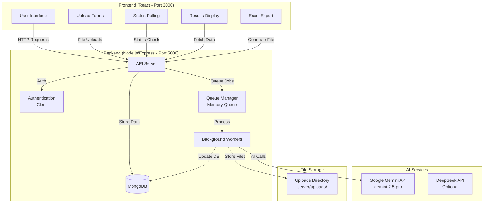
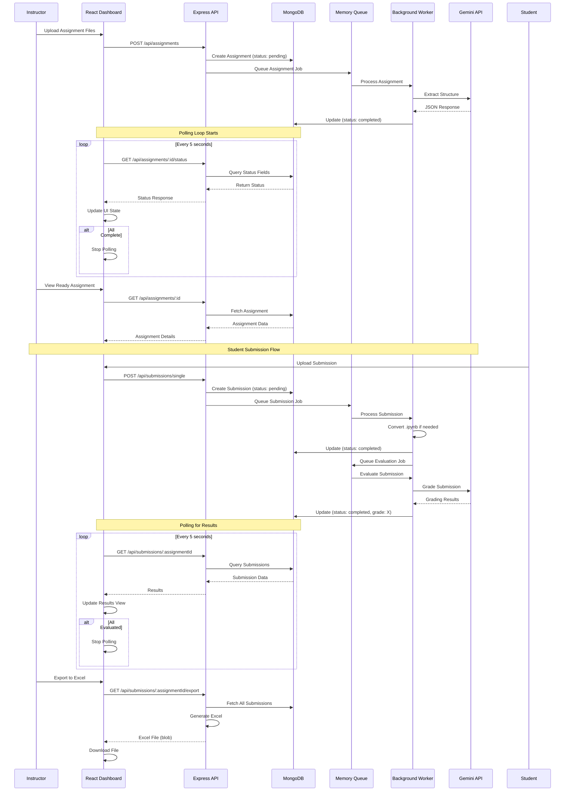
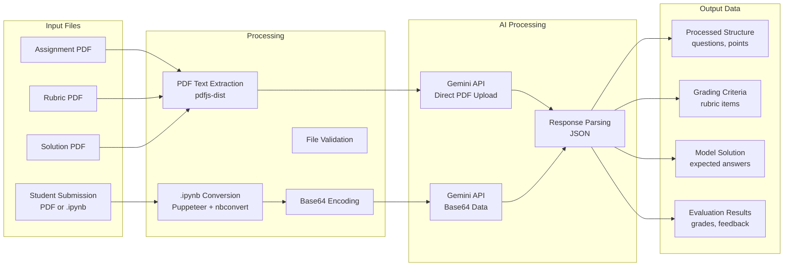
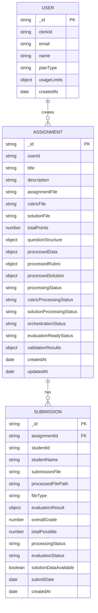
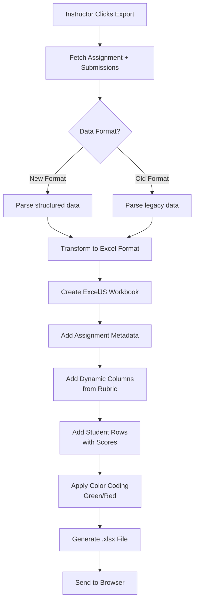
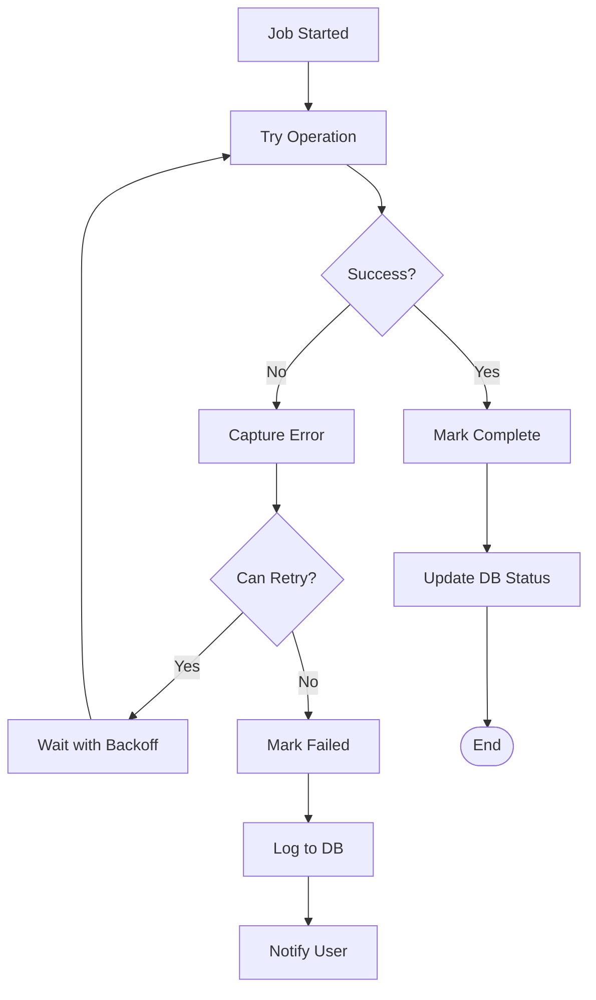
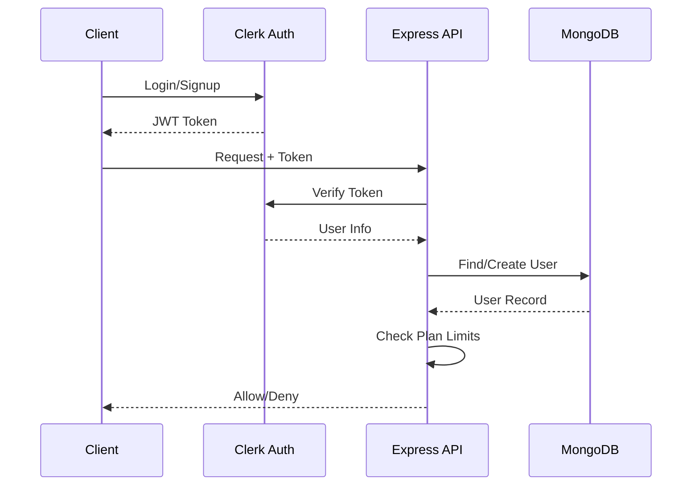
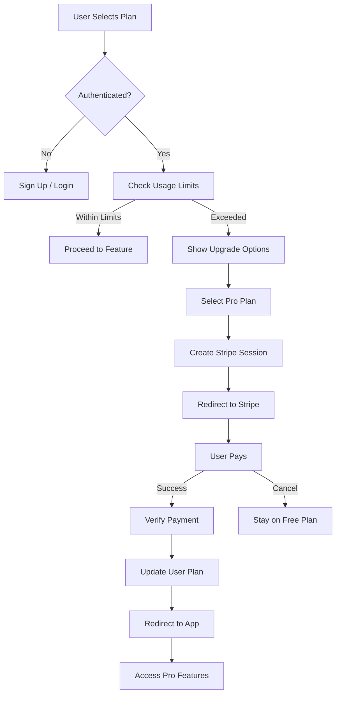

# EduGrade Complete Process Flow

## System Architecture Overview



## Complete Workflow: Assignment to Grading

```mermaid
flowchart TD
    Start([Start]) --> InstructorLogin[Instructor Login]
    InstructorLogin --> CreateAssignment[Create Assignment]
    
    CreateAssignment --> UploadFiles[Upload Files<br/>• Assignment PDF<br/>• Rubric PDF (optional)<br/>• Solution PDF (optional)]
    UploadFiles --> StoreFiles[Store Files in Uploads/]
    StoreFiles --> CreateDB[Create Assignment in DB<br/>Status: pending]
    CreateDB --> QueueAssignment[Queue Assignment Processing]
    
    QueueAssignment --> AssignmentWorker[Assignment Processor Worker]
    AssignmentWorker --> ExtractAssignment[Extract Structure via Gemini]
    ExtractAssignment --> UpdateAssignment[Update Assignment<br/>• processedData<br/>• processingStatus: completed]
    UpdateAssignment --> CheckRubric{Rubric File?}
    
    CheckRubric -->|Yes| QueueRubric[Queue Rubric Processing]
    QueueRubric --> RubricWorker[Rubric Processor Worker]
    RubricWorker --> ExtractRubric[Extract Rubric via Gemini]
    ExtractRubric --> UpdateRubric[Update Assignment<br/>• processedRubric<br/>• rubricProcessingStatus: completed]
    
    CheckRubric -->|No| CheckSolution{Solution File?}
    UpdateRubric --> CheckSolution
    
    CheckSolution -->|Yes| QueueSolution[Queue Solution Processing]
    QueueSolution --> SolutionWorker[Solution Processor Worker]
    SolutionWorker --> ExtractSolution[Extract Solution via Gemini]
    ExtractSolution --> UpdateSolution[Update Assignment<br/>• processedSolution<br/>• solutionProcessingStatus: completed]
    
    CheckSolution -->|No| CheckReady[Check Evaluation Ready]
    UpdateSolution --> CheckReady
    
    CheckReady -->|Ready| UpdateStatus[Update EvaluationReadyStatus: ready]
    CheckReady -->|Partial| UpdateStatusPartial[Update EvaluationReadyStatus: partial]
    
    UpdateStatus --> ReadyForSubmissions[Assignment Ready for Submissions]
    UpdateStatusPartial --> ReadyForSubmissions
    
    ReadyForSubmissions --> StudentLogin[Student Login]
    StudentLogin --> UploadSubmission[Upload Submission<br/>• PDF or .ipynb]
    UploadSubmission --> StoreSubmission[Store Original File]
    StoreSubmission --> CheckType{File Type?}
    
    CheckType -->|.ipynb| ConvertPDF[Convert to PDF<br/>using Puppeteer]
    CheckType -->|.pdf| QueueSubmission[Queue Submission Processing]
    ConvertPDF --> StoreConverted[Store Converted PDF]
    StoreConverted --> QueueSubmission
    
    QueueSubmission --> SubmissionWorker[Submission Processor Worker]
    SubmissionWorker --> ProcessSubmission[Process Submission<br/>• Extract text<br/>• Prepare for evaluation]
    ProcessSubmission --> UpdateSubmission[Update Submission<br/>• processingStatus: completed<br/>• processedFilePath]
    UpdateSubmission --> QueueEvaluation[Queue Evaluation]
    
    QueueEvaluation --> EvaluationWorker[Evaluation Worker]
    EvaluationWorker --> CheckLandingAI{Landing AI Configured?}
    
    CheckLandingAI -->|Yes| TwoStage[Two-Stage Processing]
    TwoStage --> ExtractContent[Extract via Landing AI]
    ExtractContent --> EvaluateWithContent[Evaluate via Gemini<br/>with extracted content]
    
    CheckLandingAI -->|No| DirectEval[Direct PDF Evaluation]
    DirectEval --> EvaluatePDF[Evaluate via Gemini<br/>with PDF]
    
    EvaluateWithContent --> StoreResults[Store Evaluation Results]
    EvaluatePDF --> StoreResults
    
    StoreResults --> UpdateSubmissionResults[Update Submission<br/>• evaluationResult<br/>• overallGrade<br/>• evaluationStatus: completed]
    UpdateSubmissionResults --> InstructorView[Instructor Views Results]
    
    InstructorView --> ExportExcel[Export to Excel]
    ExportExcel --> Download[Download Results File]
    
    Download --> End([End])
```

## Detailed Worker Processing Flow

```mermaid
flowchart TB
    subgraph "Assignment Processing Queue"
        A1[Job Created] --> A2[assignmentProcessor.js]
        A2 --> A3[Read Assignment PDF]
        A3 --> A4[Call Gemini API]
        A4 --> A5[Extract Structure]
        A5 --> A6[Save to DB]
        A6 --> A7[Update Status]
    end

    subgraph "Rubric Processing Queue"
        R1[Job Created] --> R2[rubricProcessor.js]
        R2 --> R3{Separate Rubric File?}
        R3 -->|Yes| R4[Read Rubric PDF]
        R3 -->|No| R5[Extract from Assignment]
        R4 --> R6[Call Gemini API]
        R5 --> R6
        R6 --> R7[Extract Grading Criteria]
        R7 --> R8[Save to DB]
        R8 --> R9[Update Status]
    end

    subgraph "Solution Processing Queue"
        S1[Job Created] --> S2[solutionProcessor.js]
        S2 --> S3[Read Solution PDF]
        S3 --> S4[Call Gemini API]
        S4 --> S5[Extract Model Solution]
        S5 --> S6[Save to DB]
        S6 --> S7[Update Status]
    end

    subgraph "Submission Processing Queue"
        SB1[Job Created] --> SB2[submissionProcessor.js]
        SB2 --> SB3{File Type?}
        SB3 -->|.ipynb| SB4[Convert to PDF]
        SB3 -->|.pdf| SB5[Extract Text]
        SB4 --> SB5
        SB5 --> SB6[Save Processed File]
        SB6 --> SB7[Update Status]
    end

    subgraph "Evaluation Queue"
        E1[Job Created] --> E2[evaluationProcessor.js]
        E2 --> E3[Fetch Assignment Data]
        E3 --> E4[Fetch Rubric Data]
        E4 --> E5[Fetch Solution Data]
        E5 --> E6[Fetch Submission File]
        E6 --> E7{Landing AI?}
        E7 -->|Yes| E8[Extract via Landing AI]
        E7 -->|No| E9[Direct PDF to Gemini]
        E8 --> E10[Evaluate via Gemini]
        E9 --> E10
        E10 --> E11[Parse Results]
        E11 --> E12[Save to DB]
        E12 --> E13[Update Status]
    end

    subgraph "Orchestration Queue (Manual)"
        O1[Manual Trigger] --> O2[orchestrationProcessor.js]
        O2 --> O3[Fetch All Data]
        O3 --> O4[Validate Consistency]
        O4 --> O5[Check Completeness]
        O5 --> O6[Generate Warnings]
        O6 --> O7[Save Validation Results]
        O7 --> O8[Update Status]
    end
```



## Frontend Polling & Status Management



## File Processing Details



## Database Schema Flow



## Excel Export Flow



## Error Handling & Retry Logic



## Key Status States

```mermaid
stateDiagram-v2
    [*] --> pending
    
    pending --> processing : Queue Job
    processing --> completed : Success
    processing --> failed : Error
    
    completed --> [*]
    failed --> [*]
    
    pending --> not_applicable : Optional Step
    
    state Assignment {
        pending --> processing : Upload
        processing --> completed : Extracted
        completed --> ready : All Docs Ready
    }
    
    state Submission {
        pending --> processing : Upload
        processing --> completed : Converted
        completed --> evaluating : Queue Eval
        evaluating --> completed : Graded
    }
    
    state EvaluationReady {
        not_ready --> partial : Assignment Only
        not_ready --> ready : All + Rubric + Solution
        partial --> ready : Rubric/Solution Added
    }
```

## Authentication & Authorization Flow



## Payment & Subscription Flow



---

## Summary

This document shows the complete flow of EduGrade:

1. **Assignment Creation**: Instructor uploads files → Queue processing → AI extraction → DB storage
2. **Student Submission**: File upload → Conversion (if needed) → Queue evaluation → AI grading → Results
3. **Status Management**: Continuous polling → Real-time UI updates
4. **Results Export**: Dynamic Excel generation with color coding
5. **Authentication**: Clerk-based auth with plan limits
6. **Payment**: Stripe integration for plan upgrades

All heavy operations are handled asynchronously via the custom in-memory queue system, ensuring the UI remains responsive while processing occurs in the background.


